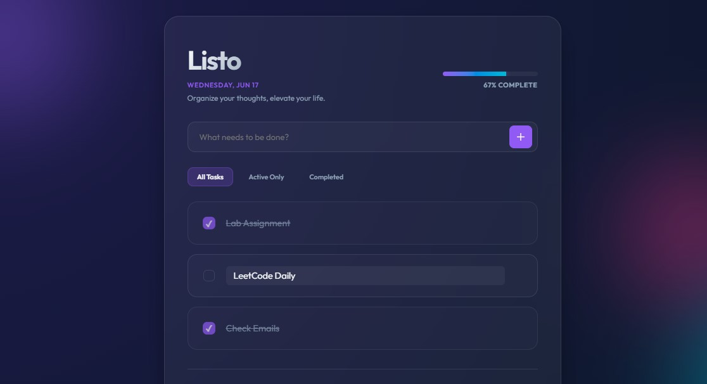

# 🎯 Listo | Premium To-Do Experience

Listo is a modern, high-performance To-Do application designed with a focus on **visual excellence** and **user experience**. Built with Vanilla JavaScript and Vite, it features a stunning glassmorphic interface, smooth animations, and intuitive interaction patterns.



## ✨ Features

- **💎 Premium Glassmorphism UI**: A sleek, dark-themed interface with vibrant gradient blurs and frosted glass effects.
- **� Real-time Progress Tracking**: Visualize your productivity with a dynamic progress bar that updates as you complete tasks.
- **📝 Inline Editing**: Edit your tasks directly in the list with a simple click—no clunky modal windows required.
- **🔍 Smart Filtering**: Easily organize your view with filters for All, Active, and Completed tasks.
- **⚡ Persistent Storage**: Your tasks are automatically saved to `localStorage`, so they're always there when you return.
- **📅 Dynamic Header**: Stay grounded with a live-updating date and motivational subtitles.
- **🧹 Quick Cleanup**: One-click "Clear Completed" to keep your workspace tidy.
- **📱 Fully Responsive**: Optimized for everything from mobile phones up to high-resolution desktops.

## 🛠️ Technology Stack

- **Core**: HTML5, Vanilla JavaScript (ES6+)
- **Styling**: CSS3 (Custom Properties, Flexbox, Grid, Keyframe Animations)
- **Build Tool**: [Vite](https://vitejs.dev/)
- **Typography**: [Outfit](https://fonts.google.com/specimen/Outfit) via Google Fonts

## 🚀 Getting Started

### Prerequisites

- [Node.js](https://nodejs.org/) (v18 or higher recommended)
- [npm](https://www.npmjs.com/)

### Installation

1. **Clone the repository**
   ```bash
   git clone https://github.com/your-username/listo-todo.git
   cd listo-todo
   ```

2. **Install dependencies**
   ```bash
   npm install
   ```

3. **Start the development server**
   ```bash
   npm run dev
   ```

4. **Open your browser**
   Navigate to `http://localhost:5173` to see the magic happen!

## 📖 Usage Guide

- **Adding Tasks**: Type your task in the input field and press `Enter` or click the `+` button.
- **Completing Tasks**: Click the checkbox next to any task to mark it as complete.
- **Editing Tasks**: Click directly on a task's text to edit it. Press `Enter` or click away to save.
- **Deleting Tasks**: Hover over a task and click the trash icon to remove it.
- **Filtering**: Use the filter buttons above the list to focus on specific tasks.

## 🎨 Design Philosophy

Listo was built on the principle that **productivity tools should be beautiful**. We utilize:
- **HSL Color Palettes**: For harmonious, vibrant accents.
- **Micro-interactions**: Subtle hover states and entry animations for a tactile feel.
- **Glassmorphism**: Layered transparency and backdrop filters to create depth.

---

Built by Isha Javed.
